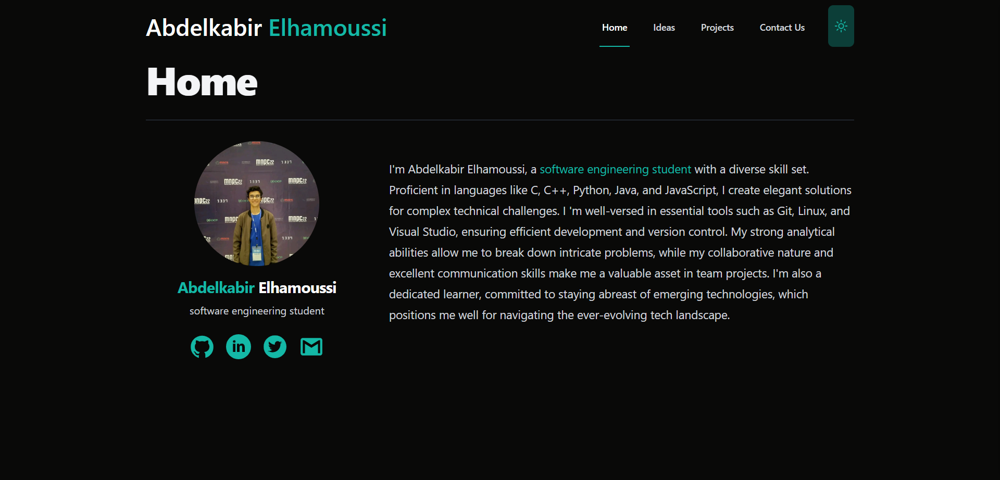

# Portfolio Website

This is my personal portfolio website built with [Next.js](https://nextjs.org/) and [Tailwind CSS](https://tailwindcss.com/).
# Screenshot



## Table of Contents

- [Features](#features)
- [Setup](#setup)
- [Development](#development)
- [Deployment](#deployment)
- [Technologies Used](#technologies-used)
- [Contributing](#contributing)
- [License](#license)

## Features

- Responsive design
- Dark mode support
- Interactive UI with animations
- Projects showcase
- Contact form

## Setup

To set up this project locally, follow these steps:

1. **Clone the repository:**

    ```sh
    git clone https://github.com/yourusername/portfolio-website.git
    cd portfolio-website
    ```

2. **Install dependencies:**

    ```sh
    npm install
    ```

3. **Create a `.env` file:**

    Create a `.env.local` file in the root directory and add any necessary environment variables. For example:

    ```env
    NEXT_PUBLIC_API_URL=https://api.example.com
    ```

## Development

To start the development server, run:

```sh
npm run dev
